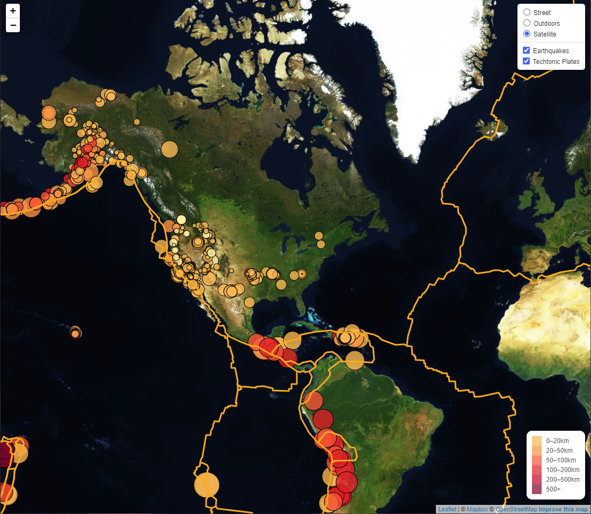

# leaflet-challenge
Welcome to leaflet-challenge! Included in the repository is a challenge to create a working leaflet map to display earthquake information from the <a href="https://earthquake.usgs.gov/earthquakes/feed/v1.0/geojson.php">USGS</a> over the past week. The solution to the two parts are in Leaflet-Step-1 and Leaflet-Step-2 directories.

## Leaflet-Step-2

Leaflet-Step-2 includes the code from step 1, but with the techtonic plate lines added onto the map. The app allows for the selecting the map style(Street, Outdoors, Satellite) and the viewable data(Earthquakes and Techtonic plates). 

### How to use
If you would like to use the app, you must download the Leaflet-Step-2 directory. Then you must add your own api key to static/js/config.js. You can get your api key from <a href="https://www.mapbox.com/">mapbox.com</a>
